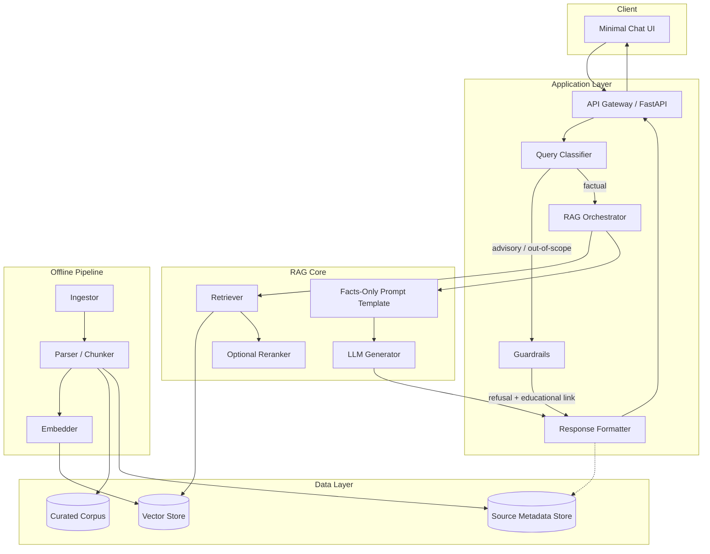
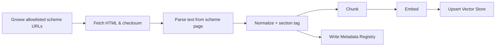
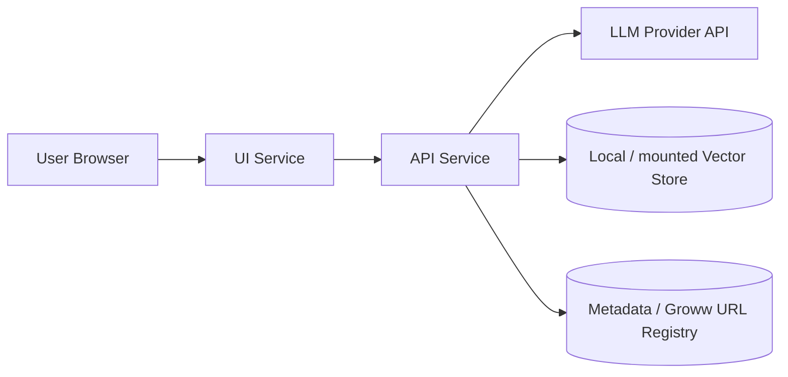

# Architecture: Mutual Fund FAQ Assistant (Facts-Only RAG)

## 1. Purpose

This document defines the system architecture for a **lightweight, facts-only RAG chatbot** that answers objective mutual fund queries for five HDFC Mutual Fund schemes. The design prioritizes **accuracy, source transparency, and compliance** over open-ended generative capability.

**Product context:** Groww mutual fund scheme pages as the curated product corpus.  
**Primary principle:** Accuracy over intelligence — answer only what can be verified from the allowlisted Groww scheme URLs.

Related: [`problem_statement.md`](./problem_statement.md)

---

## 2. Design Goals

| Goal | Architectural implication |
|------|---------------------------|
| Facts-only answers | Curated corpus + query classification + grounded generation |
| Single citation per answer | Ranked retrieval returns one primary source chunk |
| Max 3 sentences | Strict response schema enforced in prompt + post-validation |
| Refusal of advice | Intent classifier / guardrail before retrieval |
| No PII | Stateless chat; no auth; no logging of sensitive fields |
| Curated Groww sources only | Ingestion allowlist = Groww scheme page URLs for the five HDFC funds |
| Lightweight | Single backend service, local/embedded vector store, minimal UI |

---

## 3. High-Level Architecture



### Request lifecycle (happy path)

1. User submits a question in the chat UI.
2. API receives the query (no user identity required).
3. **Query classifier** labels intent: `factual` | `advisory` | `performance` | `pii_risk` | `out_of_scope`.
4. Non-factual paths short-circuit to **refusal / redirect** responses.
5. Factual queries go to the **retriever**, which fetches top-k chunks from the vector store filtered by scheme/metadata.
6. The **orchestrator** builds a grounded prompt with retrieved context and hard constraints.
7. The **LLM** generates a short answer; **formatter** enforces ≤3 sentences, exactly one citation URL, and the `Last updated from sources:` footer.
8. Response is returned; nothing personally identifiable is stored.

---

## 4. Component Design

### 4.1 Minimal Chat UI

**Responsibility:** Present a compliant, low-friction Q&A surface.

| Element | Behavior |
|---------|----------|
| Welcome message | Explains facts-only scope and selected HDFC schemes |
| Example questions (3) | Pre-fill factual queries (expense ratio, exit load, SIP minimum) |
| Disclaimer (always visible) | `Facts-only. No investment advice.` |
| Chat input + message list | Stateless session in browser memory only |
| Citation display | Render source link as a clickable URL |
| Footer display | Show `Last updated from sources: <date>` |

**Non-goals for UI:** login, portfolio linking, KYC capture, comparison widgets, charts.

### 4.2 API Layer

**Suggested interface:** REST (or equivalent) with a single primary endpoint.

```http
POST /api/v1/ask
Content-Type: application/json

{
  "question": "What is the expense ratio of HDFC Large Cap Fund Direct Growth?"
}
```

```json
{
  "status": "answered" | "refused" | "redirected",
  "answer": "string (max 3 sentences)",
  "citation_url": "https://...",
  "last_updated": "YYYY-MM-DD",
  "disclaimer": "Facts-only. No investment advice."
}
```

Additional endpoints (optional):

| Endpoint | Purpose |
|----------|---------|
| `GET /api/v1/health` | Liveness |
| `GET /api/v1/schemes` | List curated schemes + categories |
| `GET /api/v1/examples` | Return the three UI example questions |

### 4.3 Query Classifier & Guardrails

Runs **before** retrieval to prevent advisory leakage and PII handling.

| Intent | Action |
|--------|--------|
| `factual` | Continue to RAG |
| `advisory` | Refuse politely; reinforce facts-only; link AMFI/SEBI education page |
| `performance` | Do not compute/compare returns; redirect to the scheme’s Groww page URL only |
| `pii_risk` | Refuse; instruct user not to share PAN/Aadhaar/account/OTP/email/phone |
| `out_of_scope` | Refuse; suggest asking scheme fact questions within corpus |

**Implementation options (lightweight):**

1. Rule-based patterns + keyword lists (fast, deterministic)  
2. Small LLM classification call with a fixed label schema  
3. Hybrid: rules first, LLM fallback for ambiguous phrasing  

Preferred for v1: **hybrid rules + LLM classifier** for reliability without heavy ML ops.

### 4.4 RAG Orchestrator

Coordinates retrieval → prompt construction → generation → validation.

Responsibilities:

- Resolve scheme entity from the query (e.g., map “HDFC mid cap” → scheme_id)
- Call retriever with filters (`scheme_id`, `doc_type`, `source_org`)
- Select **one primary citation** from the highest-ranked chunk’s metadata
- Inject corpus `last_updated` date into the response template
- Retry once with a tighter “answer only from context” prompt if validation fails
- Fall back to refusal if no relevant chunk above similarity threshold

### 4.5 Retriever & Vector Store

**Ingestion-time:** documents → chunks → embeddings → vector index + metadata.

**Query-time:** embed question → similarity search → optional metadata filters → top-k.

| Setting | Recommended v1 default |
|---------|------------------------|
| Chunk size | ~400–800 tokens (Groww scheme page sections) |
| Chunk overlap | ~50–100 tokens |
| Top-k | 3–5 for context; **1 citation** chosen from best chunk |
| Similarity threshold | Configurable; below threshold → “insufficient evidence” refusal |
| Filters | `scheme_id`, `source_org` = `groww`, `doc_type` = `scheme_page` |

**Vector store options (lightweight):** Chroma / FAISS / LanceDB (local). Prefer embedded store for demo simplicity.

### 4.6 Generator (LLM)

Constrained generation only — never unconstrained chat.

**Hard prompt constraints:**

1. Use only provided context; if missing, say you don’t have that fact in the curated sources.
2. No advice, recommendations, comparisons, or return calculations.
3. Maximum **3 sentences**.
4. Do not invent URLs; citation is supplied by the system from metadata.
5. Neutral, plain language suitable for retail investors.

**Post-generation validation (deterministic):**

- Sentence count ≤ 3  
- Exactly one citation URL present (injected by formatter if model omits it)  
- Footer date present  
- Blocklist check for advisory phrases (“you should”, “better than”, “I recommend”, etc.)

If validation fails → regenerate once or return a safe refusal.

### 4.7 Response Formatter

Canonicalizes every successful answer:

```text
<1–3 factual sentences>

Source: <groww_scheme_url>
Last updated from sources: <YYYY-MM-DD>
```

For refusals:

```text
I can only share facts from the curated Groww mutual fund pages, not investment advice.
For investor education, see: <AMFI_or_SEBI_url>
Last updated from sources: <YYYY-MM-DD>
```

---

## 5. Corpus & Offline Ingestion Pipeline

### 5.1 Curated scheme set (Groww corpus)

The **entire scheme corpus** is the five Groww mutual-fund page URLs below. Ingestion, retrieval grounding, and answer **citations** all use these URLs (domain: `groww.in`).

| Scheme ID | Scheme | Category | Source / citation URL |
|-----------|--------|----------|------------------------|
| `hdfc_mid_cap_direct_growth` | HDFC Mid Cap Fund - Direct Growth | Mid Cap | https://groww.in/mutual-funds/hdfc-mid-cap-fund-direct-growth |
| `hdfc_silver_etf_fof_direct_growth` | HDFC Silver ETF FoF - Direct Growth | Commodity / FoF | https://groww.in/mutual-funds/hdfc-silver-etf-fof-direct-growth |
| `hdfc_bse_sensex_index_direct_growth` | HDFC BSE Sensex Index Fund - Direct Growth | Index | https://groww.in/mutual-funds/hdfc-bse-sensex-index-fund-direct-growth |
| `hdfc_large_cap_direct_growth` | HDFC Large Cap Fund - Direct Growth | Large Cap | https://groww.in/mutual-funds/hdfc-large-cap-fund-direct-growth |
| `hdfc_elss_tax_saver_direct_growth` | HDFC ELSS Tax Saver Fund - Direct Plan Growth | ELSS | https://groww.in/mutual-funds/hdfc-elss-tax-saver-fund-direct-plan-growth |

### 5.2 Allowed source types

| Source org | Document types | Use |
|------------|----------------|-----|
| **Groww** (`groww.in`) | Scheme detail pages (HTML) for the five URLs above | Primary corpus for expense ratio, exit load, SIP, riskometer, benchmark, lock-in, and other on-page facts |
| AMFI / SEBI (optional, non-corpus) | Investor education pages | **Refusal / education links only** — not used as scheme-fact citations |

**Disallowed as corpus or citation:** other aggregators, blogs, YouTube, social posts, and any URL outside the Groww allowlist (except AMFI/SEBI educational links on refuse paths).

### 5.3 Document metadata schema

Every chunk must carry:

```json
{
  "chunk_id": "uuid",
  "scheme_id": "hdfc_large_cap_direct_growth",
  "scheme_name": "string",
  "source_org": "groww",
  "doc_type": "scheme_page",
  "title": "string",
  "citation_url": "https://groww.in/mutual-funds/...",
  "published_or_as_of": "YYYY-MM-DD",
  "ingested_at": "ISO-8601",
  "section": "expense_ratio | exit_load | sip | riskometer | benchmark | lock_in | process | other",
  "text": "chunk content"
}
```

Rules:

- `citation_url` **must** be the Groww scheme URL from §5.1 for that `scheme_id`
- `source_org` is always `groww` for indexed scheme chunks
- `published_or_as_of` (page as-of / last-ingest date) drives the response footer:  
  `Last updated from sources: <date>`

### 5.4 Ingestion flow



Operational rules:

- Curated allowlist = the five Groww URLs in §5.1 (not open web crawl)
- Fetch each Groww scheme page into `data/raw/{scheme_id}/` with checksum + fetch timestamp
- Manual download / saved HTML fallback if fetch is blocked
- Re-ingest updates `published_or_as_of` / `ingested_at`
- Keep raw HTML under `data/raw/` and processed artifacts under `data/processed/`

### 5.5 Fact coverage matrix (retrieval targets)

| Fact type | Typical source | Example query |
|-----------|----------------|---------------|
| Expense ratio | Groww scheme page | “What is the expense ratio of …?” |
| Exit load | Groww scheme page | “Is there an exit load on …?” |
| Min SIP | Groww scheme page | “Minimum SIP for …?” |
| ELSS lock-in | Groww ELSS scheme page | “What is the lock-in for HDFC ELSS?” |
| Riskometer | Groww scheme page | “Risk level of …?” |
| Benchmark | Groww scheme page | “Benchmark of …?” |
| Statements / capital gains process | Groww help/process content if present on page; else polite process guidance + education link | “How do I download capital gains report?” |

---

## 6. End-to-End Data Flows

### 6.1 Factual Q&A

```text
User question
  → classify = factual
  → embed query
  → retrieve top-k (filtered)
  → build grounded prompt
  → LLM generate draft
  → validate (length, advice blocklist)
  → attach single citation + last_updated
  → return answered
```

### 6.2 Advisory refusal

```text
User: "Should I invest in HDFC Mid Cap?"
  → classify = advisory
  → skip retrieval/generation of advice
  → polite refusal + AMFI/SEBI education link
  → return refused
```

### 6.3 Performance redirect

```text
User: "Which fund gave higher returns?"
  → classify = performance
  → no calculations / no comparisons
  → return the relevant Groww scheme page URL(s) only as redirect guidance
  → return redirected
```

### 6.4 PII refusal

```text
User pastes PAN / account number
  → classify = pii_risk
  → do not store/log message body beyond ephemeral processing
  → refuse and warn not to share sensitive data
```

---

## 7. Suggested Tech Stack (Lightweight)

| Layer | Option A (simple demo) | Option B (slightly more production-like) |
|-------|------------------------|------------------------------------------|
| UI | Streamlit or Gradio | Next.js / React minimal chat page |
| API | FastAPI | FastAPI + uvicorn |
| Orchestration | Python service modules | LangChain/LlamaIndex **lightly** or custom |
| Embeddings | `sentence-transformers` local | OpenAI / Voyage embeddings via API |
| Vector DB | Chroma or FAISS | Chroma / LanceDB / pgvector |
| LLM | GPT-4.1-mini / Claude Haiku-class | Same, with provider abstraction |
| Config | `.env` + YAML scheme registry | Same + secrets manager later |
| Packaging | `requirements.txt` / `pyproject.toml` | Docker Compose (api + ui) |

**Recommendation for this project:** Option A or a hybrid (FastAPI + Streamlit/Gradio + Chroma + hosted LLM) to stay lightweight while keeping clean separation of concerns.

---

## 8. Repository Layout (Proposed)

```text
MF RAG Chatbot/
├── docs/
│   ├── problem_statement.md
│   └── Architecture.md
├── data/
│   ├── raw/                 # downloaded Groww scheme HTML
│   ├── processed/           # cleaned text, chunk JSONL
│   └── registry/            # schemes.yaml (Groww URLs), sources allowlist
├── src/
│   ├── ingest/              # fetch Groww pages, parse, chunk, embed
│   ├── rag/                 # retrieve, prompt, generate, validate
│   ├── guardrails/          # classify, refuse, pii checks
│   ├── api/                 # FastAPI routes
│   └── ui/                  # minimal chat frontend
├── tests/
│   ├── test_guardrails.py
│   ├── test_response_format.py
│   └── test_retrieval_facts.py
├── .env.example
├── README.md
└── requirements.txt
```

---

## 9. Security, Privacy & Compliance Architecture

### 9.1 Privacy by design

| Control | Implementation |
|---------|----------------|
| No PII collection | No accounts, cookies for identity, or CRM sync |
| No sensitive field storage | Do not persist chat transcripts by default |
| PII detection | Pre-check rejects PAN/Aadhaar/account/OTP/email/phone patterns |
| Ephemeral processing | In-memory request handling only |
| Logging | Log intent labels + scheme_id + latency — not raw PII-bearing text |

### 9.2 Content compliance

| Control | Implementation |
|---------|----------------|
| Facts-only | Classifier + prompt constraints + post-validators |
| No advice | Advisory intent short-circuit |
| No return math | Performance intent → Groww scheme page redirect only |
| Source integrity | Groww allowlisted ingestion; citation from metadata (`groww.in`), not model invention |
| Transparent footer | Always append last-updated date from corpus metadata |

### 9.3 Disclaimer surface

Visible in UI and echoed in every API response:

> Facts-only. No investment advice.

---

## 10. Reliability & Evaluation

### 10.1 Automated checks

- **Format tests:** sentence count, citation presence, footer presence  
- **Guardrail tests:** advisory / comparison / PII prompts must refuse  
- **Golden Q&A set:** fixed factual questions with expected scheme facts and `groww.in` citation URLs  
- **Retrieval tests:** correct scheme/doc section ranked in top-k for golden queries  

### 10.2 Manual review checklist

- Spot-check answers against the live Groww scheme pages in §5.1  
- Confirm educational links on refusals resolve to AMFI/SEBI  
- Confirm UI always shows disclaimer and example questions  
- Confirm every `answered` citation is one of the five allowlisted Groww URLs  

### 10.3 Success criteria mapping

| Success criterion | Architectural owner |
|-------------------|---------------------|
| Accurate factual retrieval | Groww corpus quality + retriever filters + threshold |
| Facts-only adherence | Classifier + prompt + validators |
| Valid source citations | Metadata-driven Groww URL injection |
| Proper advisory refusal | Guardrails path |
| Clean minimal UI | UI component scope limits |

---

## 11. Known Limitations (by design)

1. **Narrow corpus:** Only five HDFC schemes on Groww; questions about other AMCs/schemes are out of scope.  
2. **No live market intelligence:** No portfolio advice, tax personalization, or return forecasting.  
3. **Stale risk if not re-ingested:** Expense ratios and loads change on Groww; footer date reflects last ingested page as-of date, not tick-by-tick market data.  
4. **Groww-only scheme sources:** All scheme facts and citations come from the allowlisted Groww URLs; AMC/AMFI/SEBI pages are not in the retrieval corpus (AMFI/SEBI used only for refusal education links).  
5. **Single citation:** Multi-document synthesis is intentionally limited to reduce hallucination and ambiguity.  
6. **LLM non-determinism:** Mitigated by grounding + validation, not eliminated.  
7. **Process answers may be thin:** If capital-gains/statement steps are not on the Groww scheme page, respond with insufficient-evidence or a generic education link — do not invent account workflows.  
8. **Page structure dependency:** Groww HTML layout changes can break parsing until selectors/ingest are updated.

---

## 12. Deployment View



**v1 deployment profile:**

- Single machine or single container host is sufficient
- Secrets (LLM API keys) via environment variables
- Vector index baked into image **or** mounted volume after Groww `ingest` job
- Optional scheduled re-ingest (cron) when Groww scheme pages change

---

## 13. Build Phases

| Phase | Outcome |
|-------|---------|
| **P0 — Foundations** | Repo layout, scheme registry with Groww URLs, sources allowlist, README skeleton |
| **P1 — Corpus** | Fetch/parse the five Groww scheme pages; chunk + embed; metadata + citations complete |
| **P2 — Guardrails** | Classifier + refusal templates + PII checks + format validators |
| **P3 — RAG path** | Retrieve → generate → cite Groww URL → footer; golden factual Q&A passing |
| **P4 — UI** | Welcome, 3 examples, persistent disclaimer, citation rendering |
| **P5 — Hardening** | Evaluation suite, known limitations doc, re-ingest notes |

---

## 14. Architecture Decision Records (ADR summary)

| Decision | Choice | Rationale |
|----------|--------|-----------|
| RAG over fine-tuning | Lightweight RAG | Small corpus; needs citations and easy updates |
| Corpus & citations | **Groww scheme page URLs** (five HDFC funds) | Single curated product source aligned with problem-statement links |
| Classify before retrieve | Guardrail-first | Prevent advisory answers even if corpus has related text |
| System-owned citations | Metadata injects the scheme’s Groww URL | Models must not invent links |
| ≤3 sentences | Hard validation | Clarity and compliance with problem statement |
| Stateless chat | No user DB | Privacy constraints |
| One AMC, five schemes | HDFC diversity set on Groww | Contained demo scope with category coverage |

---

## 15. Summary

The system is a **guardrailed RAG pipeline**: classify → retrieve from an allowlisted **Groww** corpus of five HDFC scheme pages → generate a short grounded answer → attach **one Groww citation URL** and a last-updated footer — or refuse politely when the question is advisory, comparative, performance-calculating, PII-bearing, or out of scope. The architecture deliberately trades open-ended “intelligence” for **verifiable, facts-only** mutual fund Q&A grounded in the Groww URLs defined in this document.
