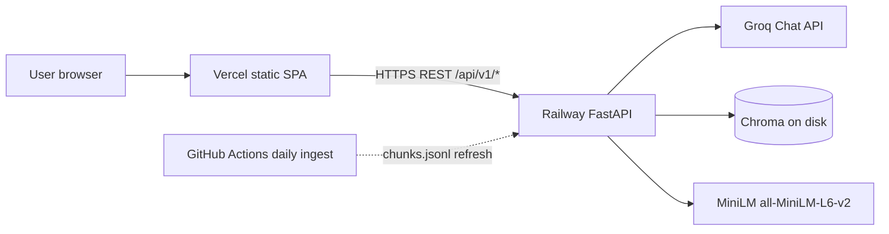

# Deployment Plan: Mutual Fund FAQ Assistant

How to host the facts-only RAG chatbot with **Railway (backend)** and **Vercel (frontend)**.

Related: [`Architecture.md`](./Architecture.md) §12, [`implementation_plan.md`](./implementation_plan.md) P4–P6, [`reingest.md`](./reingest.md).

> **Facts-only. No investment advice.**  
> Production must keep the same contract: Groq key stays on the API; the browser never sees it; citations remain allowlisted Groww URLs.

---

## 1. Why this split

| Surface | Platform | Why |
|---------|----------|-----|
| FastAPI + Chroma + MiniLM + Groq | **Railway** | Long-running Python process, local file-backed vector store, Hugging Face model cache, secrets. Not a fit for Vercel serverless (cold start, no persistent disk, torch/Chroma too heavy). |
| React + Vite chat UI | **Vercel** | Static SPA after `vite build`. CDN, preview deploys, no Python runtime needed. |

Locally the Vite **dev proxy** hides CORS (`/api` → `http://127.0.0.1:8000`). That proxy **does not exist in production**. The UI must call the Railway public URL, and the API must allow the Vercel origin.



---

## 2. What ships where

### Railway (API service)

| Include | Do not include |
|---------|----------------|
| `src/` (api, rag, guardrails, ingest, config, registry) | `frontend/` |
| `data/registry/` (schemes, allowlist, educational links) | `.env` (secrets via Railway Variables) |
| `data/processed/chunks.jsonl` (committed fact-atoms) | `data/raw/` (optional; not required at serve time) |
| `requirements.txt` (or a slimmer prod file — see §5) | Streamlit UI (`src/ui` is unused by the React app) |
| Built Chroma at `CHROMA_PATH` (generated at image build or boot) | Git history of `data/processed/chroma/` (gitignored) |

**Start command (production):**

```bash
uvicorn src.api.main:app --host 0.0.0.0 --port $PORT --workers 1
```

Use **one worker**. MiniLM + Chroma live in process memory; extra workers duplicate ~hundreds of MB and are unnecessary for demo traffic. Do **not** use `--reload`.

**Healthcheck:** `GET /api/v1/health` (already returns `{ "status": "ok" }`). Configure Railway healthcheck path to `/api/v1/health` so traffic switches only after uvicorn is listening on `$PORT`.

### Vercel (UI project)

| Setting | Value |
|---------|--------|
| Root Directory | `frontend` |
| Framework | Vite |
| Build command | `npm run build` (`tsc -b && vite build`) |
| Output directory | `dist` (Vite default) |
| Node | 20.x |
| Rewrites | SPA fallback `/(.*) → /index.html` (safe even with a single route) |

The UI reads `import.meta.env.VITE_API_BASE_URL` ([`frontend/src/api/client.ts`](../frontend/src/api/client.ts)). Vite **inlines** that value at **build time**. Changing the Railway URL later requires a **Vercel rebuild**, not just a runtime env edit.

---

## 3. Target topology (v1)

| Item | Decision |
|------|----------|
| Environments | One production pair (Railway + Vercel). Optional: Vercel Preview + a Railway staging service later. |
| Auth | None (by design). Public read-only FAQ API. |
| TLS / domains | Platform defaults first (`*.up.railway.app`, `*.vercel.app`). Custom domains optional later. |
| Vector index | Rebuild from committed `chunks.jsonl` at **Docker build** (46 atoms — seconds, not minutes). |
| Daily corpus refresh | Keep GitHub Actions P6; publish by committing `chunks.jsonl` (and processed text) so Railway redeploys and rebuilds Chroma. |
| Groq | Railway secret `GROQ_API_KEY` only. Never add it to Vercel. |

---

## 4. Gaps to close before first deploy

These are **code/config changes** the current repo does not have. Do them in this order; they are small and unblock hosting.

### 4.1 CORS origins from environment

[`src/api/main.py`](../src/api/main.py) currently allows only `http://localhost:5173` and `http://127.0.0.1:5173`. Production UI origin will be `https://<project>.vercel.app` (plus a custom domain if added).

Add settings, for example:

| Variable | Example |
|----------|---------|
| `CORS_ORIGINS` | Comma-separated list: `https://mf-faq.vercel.app,http://localhost:5173` |

Rules:

- Keep `allow_credentials=True` only if you still list explicit origins (wildcard `*` is invalid with credentials). This API does not use cookies; `allow_credentials=False` plus an explicit origin list is simpler.
- Include the exact Vercel production origin (no trailing slash).
- Optionally allow `https://.*\.vercel\.app` via `allow_origin_regex` for Preview deploys, or skip Preview→prod-API until you want it.
- Railway’s healthcheck host is `healthcheck.railway.app`. That is **not** a browser CORS request; no CORS change is required for healthchecks.

### 4.2 Bind to Railway `$PORT`

Local scripts pin `127.0.0.1:8000`. Production must listen on `0.0.0.0` and `os.environ["PORT"]`. Encode that in the Dockerfile `CMD` / `railway.toml` start command, not in `--reload` run scripts.

### 4.3 Dockerfile (recommended over Nixpacks)

`sentence-transformers` pulls **PyTorch**. Unconstrained `pip install` can pull a CUDA wheel and blow image size or RAM. Pin CPU torch in the image:

```text
python:3.11-slim
→ install CPU torch wheel
→ pip install -r requirements.txt
→ pre-download all-MiniLM-L6-v2 into HF cache
→ python -m src.ingest.run --rebuild   # bake Chroma into the image
→ uvicorn on $PORT
```

Also add `.dockerignore`: `.venv`, `frontend/node_modules`, `frontend/dist`, `.git`, `data/raw`, tests (optional), `docs/` (optional). Keep `data/processed/chunks.jsonl` and `data/registry/`.

Suggested `railway.toml` (or dashboard equivalent):

```toml
[build]
builder = "DOCKERFILE"
dockerfilePath = "Dockerfile"

[deploy]
healthcheckPath = "/api/v1/health"
healthcheckTimeout = 300
restartPolicyType = "ON_FAILURE"
restartPolicyMaxRetries = 5
```

Raise healthcheck timeout if first boot still downloads MiniLM (should not, if the model is baked in the image). `warmup_retriever()` in FastAPI lifespan loads MiniLM + Chroma; that can take 15–60s on a small replica even with a warm cache.

### 4.4 Production Python dependencies

[`requirements.txt`](../requirements.txt) includes `streamlit`, `pytest`, `pypdf` — unused at serve time. Optional: `requirements-prod.txt` without them to shrink the image. Keep `chromadb`, `sentence-transformers`, `fastapi`, `uvicorn`, `groq`, `pydantic-settings`, `pyyaml`, `python-dotenv`, `beautifulsoup4` (only needed if ingest runs in the same image).

If ingest stays on GitHub Actions only, the Railway image still needs `chromadb` + `sentence-transformers` for **query-time** embedding.

### 4.5 Vercel project config

Add `frontend/vercel.json` (or set the same in the dashboard):

```json
{
  "rewrites": [{ "source": "/(.*)", "destination": "/index.html" }]
}
```

No Vercel serverless functions are required.

### 4.6 Frontend production copy

[`frontend/src/App.tsx`](../frontend/src/App.tsx) currently says *“Start the backend with: uvicorn …”* when health fails. Harmless, but replace with a generic “API unavailable — try again later” for production (or branch on `import.meta.env.PROD`).

### 4.7 `.env.example` additions

Document new vars (do not commit values):

```text
CORS_ORIGINS=http://localhost:5173,http://127.0.0.1:5173
```

Frontend:

```text
VITE_API_BASE_URL=https://<railway-service>.up.railway.app
```

No trailing slash on `VITE_API_BASE_URL` (client concatenates `/api/v1/...`).

---

## 5. Railway — backend

### 5.1 Resource size

| Constraint | Implication |
|------------|-------------|
| MiniLM + torch (CPU) + Chroma + FastAPI | Plan for **≥1 GB RAM**; **2 GB** is safer for first boot. 512 MB Hobby often OOMs while loading the embedding model. |
| Disk | Image with baked Chroma + HF cache is a few hundred MB. 46 vectors are tiny; the model is the bulk. |
| CPU | Burst OK; one replica is enough. |
| Region | Closest to India if most users are IST (optional). Groq is an external HTTPS call regardless. |

### 5.2 Service setup (dashboard or CLI)

1. Create a Railway project (e.g. `mf-rag-chatbot`).
2. Add **one** service from this GitHub repo (root = this project, not `frontend/`).
3. Connect the GitHub repo; enable auto-deploy on `main` (or `master`).
4. Set builder to Dockerfile once `Dockerfile` exists.
5. Generate a public HTTPS domain on the service.
6. Set variables in §7. Never put `GROQ_API_KEY` in the Dockerfile or git.

**Ignore frontend paths for this service** so UI-only commits do not rebuild the heavy Python image if you later split watch patterns. Until then, any `main` push rebuilds the API — acceptable for v1.

### 5.3 Vector index strategy (locked for v1)

`data/processed/chroma/` is **gitignored**. Serving cannot rely on a checked-in index.

**Chosen strategy: bake Chroma in the Docker image** from committed `data/processed/chunks.jsonl`.

```text
chunks.jsonl (git) → docker build → python -m src.ingest.run --rebuild
                 → /app/data/processed/chroma inside the image
                 → CHROMA_PATH=data/processed/chroma at runtime
```

Why this, not a Railway volume, for v1:

- Corpus is 46 fact-atoms; rebuild is cheap and deterministic.
- No volume mount, no rsync, no “which replica has the files?”.
- Every deploy gets a known-good index matching the commit.
- Matches P1 contract: `--rebuild` so stale `chunk_id`s cannot linger.

**Not chosen for v1:**

| Alternative | When to revisit |
|-------------|-----------------|
| Railway volume at `CHROMA_PATH` | If ingest must run **on** Railway without a git commit. |
| Download GitHub Actions artifact at boot | Fragile (artifact expiry 14 days, auth token, slow boot). |
| Rebuild Chroma on every container start | Works, but wastes boot time and can fail healthchecks; prefer build-time. |

Set `CHROMA_PATH=data/processed/chroma` (relative; [`src/config.py`](../src/config.py) resolves against project root).

### 5.4 Hugging Face model

Query-time retrieval loads `all-MiniLM-L6-v2` on CPU ([`embed_index.py`](../src/ingest/embed_index.py)). First download is slow and can fail if Hugging Face is blocked.

Bake it in the Dockerfile:

```bash
python -c "from sentence_transformers import SentenceTransformer; SentenceTransformer('all-MiniLM-L6-v2')"
```

Env in the image:

```text
HF_HOME=/app/.cache/huggingface
HF_HUB_DISABLE_TELEMETRY=1
TRANSFORMERS_OFFLINE=1   # after the model is in the image
```

Do **not** set `TRANSFORMERS_OFFLINE=1` until the model is actually in the layer.

### 5.5 Groq at runtime

- Railway injects `GROQ_API_KEY`.
- If the key is missing, the API still boots; [`get_optional_groq_client`](../src/api/main.py) returns `None` and the orchestrator uses the no-Groq fallback. Production **should** set the key so classification and grounded generation work.
- Outbound HTTPS to Groq must be allowed (default on Railway).
- On Groq errors the API already returns a safe 500 / refusal path — do not bypass guardrails in a “prod hotfix.”

### 5.6 Ingest on Railway?

**Do not run the daily Groww fetch inside the API replica** for v1.

- Fetch can be blocked by Groww (see [`reingest.md`](./reingest.md)).
- Mixing scrape + serve on one replica risks OOM and failed healthchecks.
- P6 already runs fetch → parse → chunk → embed → `retrieve_check` on GitHub Actions.

Keep Railway as **serve-only**. Ingest stays on Actions; the publish path is §8.

---

## 6. Vercel — frontend

### 6.1 Project setup

1. Import the **same GitHub repo** in Vercel.
2. Set **Root Directory** to `frontend`.
3. Framework preset: Vite (or Other with the commands in §2).
4. Add `VITE_API_BASE_URL` **before the first production build** (Production environment).
5. Deploy.

Chicken-and-egg with CORS:

1. Deploy Railway first (CORS can still include localhost).
2. Copy the Railway public URL (no trailing slash), e.g. `https://mf-rag-api-production.up.railway.app`.
3. Set `VITE_API_BASE_URL` on Vercel → deploy UI.
4. Set Railway `CORS_ORIGINS` to the Vercel origin (`https://<project>.vercel.app`) → **redeploy or restart** the API so FastAPI reloads settings.

Until step 4, the browser will show a CORS failure even if `GET /api/v1/health` works from curl.

### 6.2 Preview deployments

Vercel Preview URLs change per PR. Options:

| Option | v1 recommendation |
|--------|-------------------|
| Ignore Preview | **Yes** — point Preview `VITE_API_BASE_URL` at Railway prod only if you accept coupling; or leave unset so Preview is UI-only. |
| Regex CORS | Allow `https://.*\.vercel\.app$` on the API if you want every Preview to hit prod API. |
| Staging API | Separate Railway environment later. |

`VITE_API_BASE_URL` is per Vercel environment (Production / Preview / Development). Set Production and Preview independently.

### 6.3 What not to put on Vercel

- `GROQ_API_KEY`
- `CHROMA_PATH` / embedding models
- Any Python ingest job

The SPA only needs the public API base URL.

---

## 7. Environment variables

### Railway (API)

| Variable | Required | Notes |
|----------|----------|--------|
| `GROQ_API_KEY` | **Yes** (prod) | Railway Variables → secret. From [console.groq.com/keys](https://console.groq.com/keys). |
| `GROQ_CHAT_MODEL` | No | Default in [`.env.example`](../.env.example): `qwen/qwen3.6-27b` |
| `GROQ_CLASSIFY_MODEL` | No | Default: `openai/gpt-oss-20b` |
| `GROQ_CHAT_TEMPERATURE` | No | `0.1` |
| `GROQ_CLASSIFY_TEMPERATURE` | No | `0.2` |
| `GROQ_CHAT_MAX_TOKENS` | No | `256` |
| `CHROMA_PATH` | No | `data/processed/chroma` |
| `EMBEDDING_MODEL` | No | `all-MiniLM-L6-v2` |
| `RETRIEVAL_MAX_DISTANCE` | No | `1.15` |
| `RETRIEVAL_TOP_K` | No | `3` |
| `CORS_ORIGINS` | **Yes** (after §4.1) | Vercel origin(s) + local if needed |
| `PORT` | Injected | Do not override unless you know Railway healthcheck implications. |

Copy values from `.env.example`; never commit `.env`.

### Vercel (UI)

| Variable | Required | Notes |
|----------|----------|--------|
| `VITE_API_BASE_URL` | **Yes** | Railway public origin, **no trailing slash**, HTTPS. Inlined at build. |

---

## 8. Daily ingest → production index

Today [`.github/workflows/daily-ingest.yml`](../.github/workflows/daily-ingest.yml) uploads a **14-day GitHub Actions artifact**. That does **not** update Railway by itself.

### v1 publish path (recommended)

Extend the existing workflow **after** `retrieve_check` / pytest succeed:

1. Commit (or open a PR for) updated:
   - `data/processed/chunks.jsonl`
   - `data/processed/{scheme_id}/scheme_page.txt` and `parse_manifest.json` (already tracked)
2. Push to `main` (or merge the ingest PR).
3. Railway auto-builds a new image, rebuilds Chroma from the new JSONL, and healthchecks `/api/v1/health`.
4. No Vercel redeploy is required (UI does not embed corpus data).

Workflow needs `permissions: contents: write` (and a token that can push), plus a bot commit message such as `chore: daily Groww corpus refresh`. Use `concurrency: daily-ingest` already present so overlapping runs do not fight.

**Do not commit** `data/processed/chroma/` (binary; still gitignored). The Dockerfile rebuilds it.

If Groww blocks fetch, the job **fails** (strict fetch) and production keeps the last good image — fail closed, same as P6.

### Alternatives (later)

| Path | Use when |
|------|----------|
| Railway Cron + volume | You want ingest off GitHub; still need Groww-block handling. |
| `railway up` / CLI sync of Chroma | Emergency only; drifts from git. |
| Artifact download at API boot | Avoid — slow, token-heavy, 14-day expiry. |

---

## 9. Deploy sequence (first production)

Do this once after §4 lands on `main`.

### A. GitHub

- [ ] `Dockerfile`, `.dockerignore`, `railway.toml` (or dashboard build settings)
- [ ] `CORS_ORIGINS` wired in FastAPI
- [ ] `frontend/vercel.json`
- [ ] `.env.example` updated
- [ ] CI still green: `pytest -m "not integration"`

### B. Railway

1. New project + service from repo (root of this app).
2. Confirm Python/Docker build uses the Dockerfile.
3. Set `GROQ_API_KEY` and model vars.
4. Set `CORS_ORIGINS` to localhost for now (or skip until Vercel URL exists).
5. Deploy. Wait for healthcheck on `/api/v1/health`.
6. Smoke from your machine (replace the host):

```bash
curl -sS https://<railway-host>/api/v1/health
curl -sS https://<railway-host>/api/v1/schemes
curl -sS https://<railway-host>/api/v1/examples
curl -sS -X POST https://<railway-host>/api/v1/ask \
  -H "Content-Type: application/json" \
  -d "{\"question\":\"What is the expense ratio of HDFC Large Cap Fund Direct Growth?\"}"
```

Expect `status: answered` or a grounded refusal, **one Groww URL**, `last_updated`, disclaimer. Advisory probe:

```bash
curl -sS -X POST https://<railway-host>/api/v1/ask \
  -H "Content-Type: application/json" \
  -d "{\"question\":\"Should I invest in HDFC Mid Cap?\"}"
```

Expect `status: refused` and an AMFI/SEBI education link — not advice.

### C. Vercel

1. New project, Root Directory `frontend`.
2. Set `VITE_API_BASE_URL=https://<railway-host>` (Production).
3. Deploy.
4. Copy the production origin (`https://<project>.vercel.app`).

### D. Close CORS

1. Set Railway `CORS_ORIGINS` to the Vercel origin (and localhost if you still want local UI → prod API).
2. Redeploy/restart Railway.
3. Open the Vercel URL: sidebar lists five HDFC schemes, examples load, disclaimer visible.
4. Ask the Large Cap expense-ratio example; confirm citation link and footer.
5. Ask “Should I invest in this fund?”; confirm polite refusal.

### E. Optional hardening same day

- Custom domains on both platforms; update `CORS_ORIGINS` and `VITE_API_BASE_URL` (Vercel **rebuild**).
- Restrict Railway to HTTPS only (default).
- Turn off public Railway TCP/other ports; HTTP service only.

---

## 10. Verification checklist (prod)

| Check | Pass |
|-------|------|
| `GET /api/v1/health` → `ok` | |
| `GET /api/v1/schemes` → five HDFC schemes + Groww URLs | |
| Factual ask → ≤3 sentences, one `groww.in` citation, last-updated footer, disclaimer | |
| Advisory ask → refused + education link | |
| Performance / “which is better” → refuse or Groww redirect, **no** computed returns | |
| UI disclaimer always visible | |
| Browser network: API calls go to Railway, not `localhost` | |
| No `GROQ_API_KEY` in Vercel env or page source | |
| Railway logs: `ask status=… intent=… scheme_id=… latency_ms=…` — no raw PII | |
| Index ready: no “run `python -m src.ingest.run`” warning on a healthy boot | |

Use [`docs/demo.md`](./demo.md) and [`docs/eval.md`](./eval.md) as the product walkthrough; this section is hosting-only.

---

## 11. Operations

### Restart / rollback

- **API:** Railway → Deployments → rollback to last healthy image (index is in that image).
- **UI:** Vercel → Deployments → promote previous production deployment.
- If CORS or `VITE_API_BASE_URL` is wrong, fix env then **redeploy the side that reads it** (API restart for CORS; **rebuild** UI for Vite).

### Logs

- Railway: request logs + `ask` latency lines. Do not enable body logging.
- Vercel: static hosting logs only; user questions never hit Vercel.

### Scaling

v1 = **1 API replica**. Horizontal scale duplicates MiniLM memory. If traffic grows, raise replica size before replica count.

### Cost (order of magnitude)

| Item | Notes |
|------|--------|
| Railway | RAM-driven. 2 GB replica is the main hosting cost. |
| Vercel | Hobby/Pro is enough for a static SPA. |
| Groq | Per classify + generate call; cap `GROQ_CHAT_MAX_TOKENS`. |
| GitHub Actions | Existing daily ingest minutes; adding a corpus commit does not add a second host. |

### Failure modes

| Symptom | Likely cause | What to do |
|---------|--------------|------------|
| UI “Cannot reach the API” | Wrong `VITE_API_BASE_URL`, Railway down, mixed content | curl health; rebuild UI after env change |
| CORS error in browser | `CORS_ORIGINS` missing Vercel origin, or trailing slash | Fix Railway env; restart API |
| Healthcheck timeout | MiniLM load too slow; OOM; not bound to `$PORT` | Bake model in image; raise RAM; confirm `0.0.0.0:$PORT` |
| Answers empty / index warning | `chunks.jsonl` missing in image; rebuild skipped | Check Docker COPY paths; run `--rebuild` in build |
| Wrong fund facts | Unfiltered retrieval (should not happen) or stale JSONL | Confirm `scheme_id` filter still on; re-ingest |
| Groq 429 / 5xx | Rate limit or model id retired | Retry/backoff already in product path; update model env vars (see `.env.example` decommission note) |
| Daily ingest green but prod stale | Artifact-only publish; no git commit / no Railway rebuild | Implement §8 commit path |

---

## 12. Security & compliance (hosting)

Unchanged product rules (Architecture §9) plus platform specifics:

| Control | Production behaviour |
|---------|----------------------|
| No user accounts | Neither Railway nor Vercel stores chat transcripts. |
| Secrets | `GROQ_API_KEY` only on Railway. Rotate via Groq console + Railway Variables. |
| PII | Same classifier; do not add request-body logging on Railway. |
| Public API | Anyone can `POST /api/v1/ask`. For v1 that is accepted. Optional later: Vercel-only CORS, rate limit (e.g. slowapi), or a shared header. CORS is **not** auth. |
| Citations | Still metadata-owned Groww URLs; hosting must not introduce a second corpus. |
| Disclaimer | UI + every API response. |

Optional later (not v1 blockers): Cloudflare in front of the API, IP rate limits, Groq key scoped to this app only.

---

## 13. Implementation workstream (when you execute this plan)

Suggested order — small PRs, then click-ops:

| Step | Work | Owner surface |
|------|------|----------------|
| 1 | `CORS_ORIGINS` in settings + FastAPI middleware | code |
| 2 | `Dockerfile` + `.dockerignore` + `railway.toml` | code |
| 3 | Optional `requirements-prod.txt` (drop streamlit/pytest) | code |
| 4 | `frontend/vercel.json`; production API-down copy | code |
| 5 | Create Railway service, secrets, first deploy, curl smoke | Railway |
| 6 | Create Vercel project, `VITE_API_BASE_URL`, deploy | Vercel |
| 7 | Point CORS at Vercel origin; E2E in browser | both |
| 8 | Daily ingest: commit `chunks.jsonl` on success (replace artifact-only publish) | GitHub Actions |
| 9 | README “Production” pointer to this doc | docs |

Do **not** add Docker Compose or a second UI host. Streamlit is not part of this deployment.

---

## 14. Out of scope for this deployment

- Auth, KYC, user databases
- Multi-region active-active API
- Serving Chroma from S3 / pgvector
- Putting FastAPI on Vercel Python serverless
- Putting the React app on Railway (possible, but Vercel is the chosen CDN)
- Live Groww scrape on every user question
- Fine-tuning or changing Groq into an embeddings provider

---

## 15. Summary

Host **FastAPI + MiniLM + Chroma + Groq** as a **single Railway replica** built from a **Dockerfile** that bakes the embedding model and rebuilds the 46-atom index from git-tracked `chunks.jsonl`. Host the **Vite SPA on Vercel** with `VITE_API_BASE_URL` pointing at the Railway HTTPS origin. Wire **CORS** to that Vercel origin. Keep **daily ingest on GitHub Actions**, and refresh production by **committing updated `chunks.jsonl`** so Railway rebuilds the index. Groq keys never leave Railway; the product remains facts-only, cited, and stateless.
